<div align="center">

# ChromeSetup

**The Ultimate Windows Chrome Hardening & Debloat Toolkit**

[](https://github.com/powershello/ChromeSetup/releases)
[](https://www.virustotal.com/gui/file/b8ec93c9ec3f8d0101b6538e20e7bd208d3d2d1a7c071eb996a9138b116d1d67?nocache=1)
[](https://github.com/powershello/ChromeSetup/releases)

> *A 100% open-source Windows polyglot script that automates the installation, debloating, and extreme hardening of Google Chrome. Completely lock down Enterprise policies, restore Manifest V2 support, inject uBlock Origin at the byte-level, and eradicate all Google telemetry and AI bloatware.*

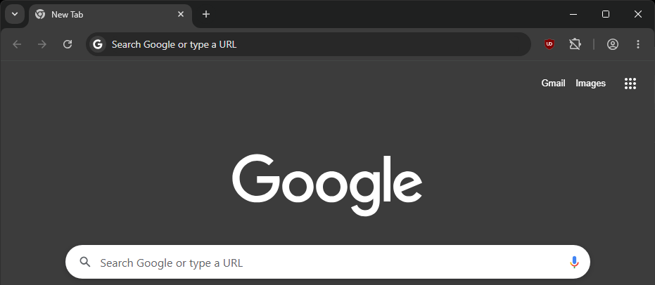

</div>

---

## 📑 Table of Contents
- [Usage & Installation](#-usage)
- [Under the Hood: Technical Specs](#-features--under-the-hood)
  - [Official Installation & Deep Cleaning](#-official-installation--deep-cleaning)
  - [Persistent Default File Associations](#-persistent-default-file-associations)
  - [Manifest V2 Support + uBlock Origin](#-manifest-v2-support--ublock-origin)
  - [Enterprise Policy Enforcement](#-chrome-enterprise-policies-enforcement)
  - [Extreme Privacy Hardening](#-extreme-privacy-hardening)
  - [Goodbye AI](#-goodbye-ai)
  - [Bloatware Purge](#-bloatware--annoyances-purge)
  - [Update & Persistence Control](#-update--persistence-control)
- [Screenshots](#-screenshots)
- [Support & Donations](#-support--donations)

---

## ⚡ USAGE

Download and run the latest [release](https://github.com/powershello/ChromeSetup/releases/latest/download/ChromeSetup.cmd) directly, or use one of the one-liners below. To run a one-liner: press `Win + R` and paste the command directly, or execute it in your preferred terminal (CMD/PowerShell).

### Standard Installation
```powershell
powershell "iwr https://github.com/powershello/ChromeSetup/releases/latest/download/ChromeSetup.cmd -o $env:TEMP\ChromeSetup.cmd; & $env:TEMP\ChromeSetup.cmd"
```

### Force Install with SearXNG
Sets [Seek.fyi](https://seek.fyi/) (SearXNG) as the default search engine.
```powershell
powershell "iwr https://github.com/powershello/ChromeSetup/releases/latest/download/ChromeSetup.cmd -o $env:TEMP\ChromeSetup.cmd; & $env:TEMP\ChromeSetup.cmd -Force -SearXNG"
```

### Silent Uninstall
```powershell
powershell "iwr https://github.com/powershello/ChromeSetup/releases/latest/download/ChromeSetup.cmd -o $env:TEMP\ChromeSetup.cmd; & $env:TEMP\ChromeSetup.cmd -Silent -Uninstall"
```

### CLI Arguments

| Argument | Description |
| :--- | :--- |
| `-Silent` | Suppress all prompts and auto-launch. |
| `-Force` | Force a fresh download even if Chrome is already installed. |
| `-SearXNG` | Set [Seek.fyi](https://seek.fyi/) (SearXNG) as the default search engine. |
| `-Uninstall` | Uninstall Chrome and completely remove all leftovers (directories, registry keys, scheduled tasks). |

> [!WARNING]
> Never download the script from third-party sources. This is the only official repository. To verify the integrity of the script, check the SHA256 hash by running this command in PowerShell:
> ```powershell
> powershell "if ((Get-FileHash <path-to-script>\ChromeSetup.cmd -Algorithm SHA256).Hash -eq '5401d72eeb9844351449930c8c4f58759e20be785aaf8409114db58f0c008f2c') { Write-Host ' [ + ] Successfully verified installer hash' -f green }"
> ```

---

## 🛠️ FEATURES

### 📦 Official Installation
Downloads the latest [stable](https://chromereleases.googleblog.com/search/label/Extended%20Stable%20updates) Chrome offline installer directly from [Google](https://dl.google.com) and executes a silent installation. If Chrome already exists on the system, the script bypasses the setup download and performs a targeted file purge across the `User Data` directory, wiping gigabytes of bloated cache, GPU shader logs, and session tracking tokens without touching user profiles.

### 🔗 Persistent Default File Associations
Sets Chrome as the default browser and PDF viewer for the following precise handlers:
`http`, `https`, `.htm`, `.html`, `.xhtml`, `.mhtml`, `.shtml`, `.xht`, `.pdf`, `.svg`, `.webp`.
- **SetUserFTA**: Bypasses the Windows Default Apps prompt using Christoph Kolbicz's [SetUserFTA](https://setuserfta.com/).
- **UCPD Neutered**: Prevents Windows from reverting to Edge by explicitly disabling the Windows [User Choice Protection Driver](https://kolbi.cz/blog/2024/04/03/userchoice-protection-driver-ucpd-sys/) (`UCPD.sys`) and its `UCPD velocity` scheduled task.
- **WMIC Restored**: Automatically downloads a standalone `WMIC` [package](https://github.com/powershello/WMIC/releases/download/wmic/WMIC.zip) for modern Windows 11 builds where Microsoft has deprecated and removed it, ensuring SetUserFTA executes flawlessly.

### 🧩 Manifest V2 Support + uBlock Origin
Fights back against Google's Manifest V2 deprecation through sheer force:
- **Shortcut & Registry Patching:** Writes critical Manifest V2 enforcement and search engine choice screen bypass flags into all desktop and start menu shortcuts. It also patches system shell open registry commands so these configurations persist even when Chrome is launched by external applications (e.g., clicking a link in Discord or other apps).
- **Taskbar Pin Injection:** Defeats Windows 10/11 Explorer's anti-pinning protections by manually parsing the binary `.lnk` PIDL (Pointer to an Item ID List) and injecting an undocumented Extra Data Block with the signature `0xBEEF001D`. This allows the script to forcefully write the modified shortcut directly into the `Taskband` registry key via Component Object Model (COM) manipulation, while preserving the Application User Model ID (AUMID). Credits to [Léo Gillet](https://github.com/Freenitial/Pin-Taskbar).
- **Raw LevelDB Injection:** Pre-installs uBlock Origin via the [external extensions](https://developer.chrome.com/docs/extensions/how-to/distribute/install-extensions#registry) Windows registry, letting the user [decide](https://imgur.com/a/1iwCbVk) to keep or remove the extension on first launch. Filters and settings are physically forced into the extension's database on-disk using a custom C# transaction writer. It calculates raw CRC32C (Castagnoli) checksums with a specific masking algorithm `((crc >> 15) | (crc << 17)) + 0xa282ead8u` and writes payload batches using LevelDB opcodes `0x01` (Put) and `0x00` (Delete) to perfectly forge the `000002.log` transaction history.
  - **Included Filters:** [EasyList](https://easylist.to) (general ad blocking), EasyPrivacy (tracking protection), URLhaus (malicious URLs), Peter Lowe's List (ad/tracking servers), and Fanboy's Annoyance & Cookie List (wipes out cookie banners, GDPR consent overlays, and social widgets).
  - **AdGuard Filters:** [AdGuard Cookies](https://adguard.com/kb/general/ad-filtering/adguard-filters/#adguard-filters) (removes cookie policy popups).
  - **Custom URL Shortener Bypass:** [LegitimateURLShortener](https://github.com/DandelionSprout/adfilt/blob/master/LegitimateURLShortener.txt).
  - **Twitch Ad Blocker:** Built-in dynamic `user-filters` utilizing [vaft](https://github.com/ryanbr/TwitchAdSolutions#scripts).
  - **Advanced Settings:** Enables dynamic filtering and configures specific hostname switches (e.g., `no-large-media`).

### 🏢 Chrome Enterprise Policies Enforcement
Tricks the operating system by spoofing a local Mobile Device Management (MDM) enrollment in the Windows registry. By supplying the required MDM state markers, enrollment flags, and a synthetic User Principal Name (UPN)—which modern Chrome versions require to recognize management policies—the script enables advanced Enterprise Group Policies on non-Domain-joined home systems. This completely circumvents the standard restriction where Windows home editions ignore corporate policies, unlocking full security customization without "Managed by your organization" warnings or blockages.
Locks down the browser by enforcing strict corporate-grade policies:
- **Automatic Session Cleanup:** Forces Chrome to automatically purge browsing history, download logs, cached images, saved passwords, autofill data, site preferences, and hosted app data every single time the browser is closed.
- **Extension Controls:** Blocks silent, forced installations of default Google-managed add-ons (such as Google Docs Offline).

### 🔐 Extreme Privacy Hardening
Directly refactors the browser's JSON `Preferences` and `Local State` configuration files, merging strict privacy controls without corrupting existing user profile settings or extensions:
- **Region Spoofing:** Configures a fallback region profile to bypass geo-targeted prompt screens, cookie consent loops, and localized user tracking systems.
- **Privacy Sandbox Neutralization:** Completely disables Google's newer ad-tracking frameworks, including the Topics API, FLEDGE (on-device ad auctions), and First-Party Sets tracking vectors.
- **Zero-Footprint History:** Hardens policy structures to physically prevent Chrome from writing your browsing history to disk, combined with a persistent "Do Not Track" signal.
- **Complete Telemetry Severance:** Eradicates all telemetry, usage statistics, diagnostics, and crash-reporting services at the system level via a STIG-compliant master policy override.
- **Credentials & Autofill Lockdown:** Deactivates forced browser sign-ins, local/cloud password managers, payment card synchronization, form autofill, and background network pre-fetching.
- **Hardened Permissions:** Denies web applications access to your camera, microphone, physical location, storage APIs, and desktop notifications by default.
- **Session State Purging:** Configures Chrome to auto-delete cached assets, form entries, and transient session files on close, while preserving essential authentication cookies so you don't get logged out of active sessions.
- **Network Leak Protection:** Enforces strict HTTPS-only mode globally and disables WebRTC direct UDP bindings to prevent your real, non-proxied IP address from leaking to the web.
- **System DNS Preservation:** Disables built-in secure DNS (DNS-over-HTTPS) at the browser level to ensure Chrome respects your system-wide VPN, DNS crypt, or local Pi-hole/AdGuard Home configurations instead of bypassing them.
- **Hardware-Level Side-Channel Defenses:** Enforces CPU core isolation across all renderer processes, establishing physical boundaries to block Spectre, Meltdown, and other hardware-level side-channel attacks attempting to steal sensitive memory from adjacent browser tabs.

> [!IMPORTANT]
> Google Safe Browsing is a Chrome feature designed to protect users from malware, malicious websites, phishing scams, malicious ads, and social engineering attacks. The level of protection can be adjusted in Chrome's settings `chrome://settings/security`. However, cybersecurity firm [Norn Labs](https://www.norn-labs.com/blog/huginn-report-feb-2026) reported that Safe Browsing failed to detect approximately 84% of phishing sites tested.
> Safe Browsing is disabled by default for a less censored and slightly faster browsing experience. For average users, re-enabling Standard protection is recommended. For advanced users, uBlock Origin alone has a [78% malware detection ratio](https://www.youtube.com/watch?v=7Q3jj2iDtc4) according to an independent test by PC Security Channel, which can be further enhanced with [oisd](https://oisd.nl) and [Hagezi](https://github.com/hagezi/dns-blocklists) filter lists.

### 🤖 Goodbye AI!
Neutralizes all generative AI features, background services, and local models. The script scans the user profile directories for the resource-heavy, silently-installed Gemini Nano AI execution binaries and physically deletes them from disk, instantly reclaiming gigabytes of wasted storage.

**Disabled Integrations:**
* **On-Device AI Engines:** Blocks the Chromium rendering engine from silently downloading or caching local GenAI models, and disables built-in web-facing AI APIs (such as the experimental LanguageModel, Summarization, and Writer APIs).
* **Google Gemini Integration:** Completely disables the Gemini side panel and prevents the assistant from scraping, parsing, or transmitting contents from your active tabs.
* **Omnibox AI & Visual Search:** Strips out conversational AI-mode input prompts from the address bar and New Tab pages, blocks the Google Search companion panel, and entirely disables Google Lens visual search integrations.
* **AI-Powered Productivity Bloat:** Disables cloud-assisted writing tools ("Help Me Write"), smart tab organization utilities, and generative browser theme creators.
* **Semantic History Search:** Disables natural language history processing and semantic search indexing on your local browsing history.
* **DevTools AI Debugging:** Deactivates automated console troubleshooting to prevent code snippets, local stack traces, and active network payloads from being transmitted to external generative AI servers.
* **Lab-Grade Deep Toggles:** Modifies Chromium's experimental state files to forcefully deactivate internal flags for local AI inference engines, the address bar's AI mode entry points, accelerated 2D canvases, and video encoding/decoding behaviors that could be abused for browser fingerprinting.

### 🗑️ Bloatware & Annoyance Deactivation
Strips out redundant browser integrations, telemetry-heavy background services, and distracting UI elements to reclaim CPU and memory:
- **Google Cast & Remote Desktop:** Deactivates the media routing framework and Chrome's remote access sub-system, preventing local device discovery and casting capabilities.
- **Hardware Acceleration:** Disables advanced GPU hardware rendering flags to run Chrome in a purely software-rendered mode, preventing browser crashes, memory leaks, and hardware-specific glitches.
- **UI Clutter & Easter Eggs:** Removes the offline dinosaur game, the built-in QR code generator, shopping lists, browser-level spellchecking, and the Google translation popups.
- **Quality-of-Life Performance Enhancements:** Modifies experimental states to force-enable high-speed multi-threaded parallel downloads, restore absolute mute buttons on individual browser tabs, and enable advanced control interfaces for extensions.

### 🚫 Update & Persistence Control
Eradicates background auto-update mechanisms and ensures the hardened configuration remains static:
- **Update Engine Disablement:** Disables Google's background update scheduled tasks, overrides the default update checks in the registry, and sets the core update service states to manual/disabled. This ensures Chrome will never bypass your preferences to perform silent background updates.
- **Active Setup Neutering:** Purges Chrome's Active Setup registry key to prevent Windows from running automatic repair scripts, redeploying tracking components, or reverting modified settings when a new user logs into the system.

### 🧹 Clean Uninstall
Fully handles both MSI and EXE installations. Cleanly removes the binary, profile data (`%LOCALAPPDATA%\Google`), registry keys (Policies, WOW6432Node), shortcuts, and leftover scheduled tasks.

---

## 📸 Screenshots

<details>
<summary>🛑 uBlock Origin filters</summary>

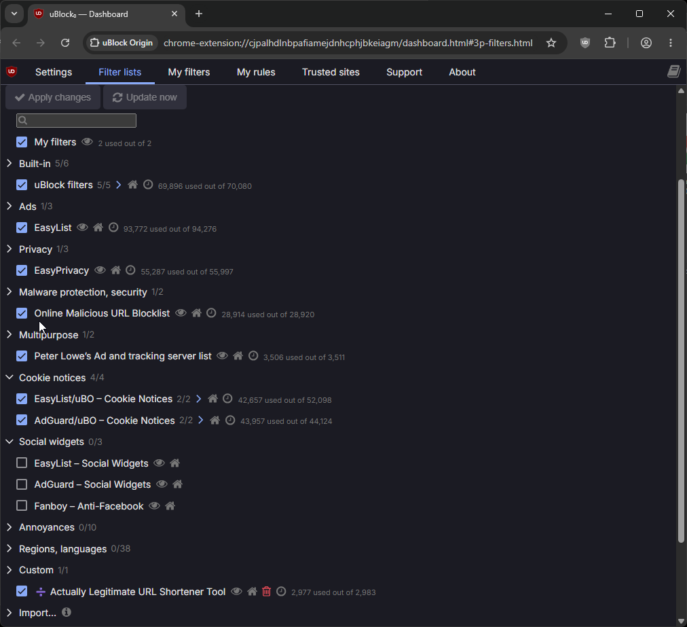
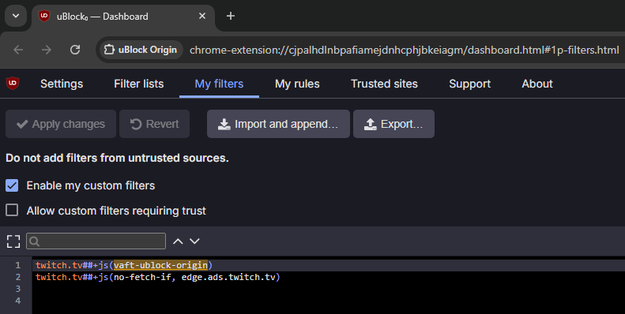

</details>

<details>
<summary>📈 Task Manager</summary>

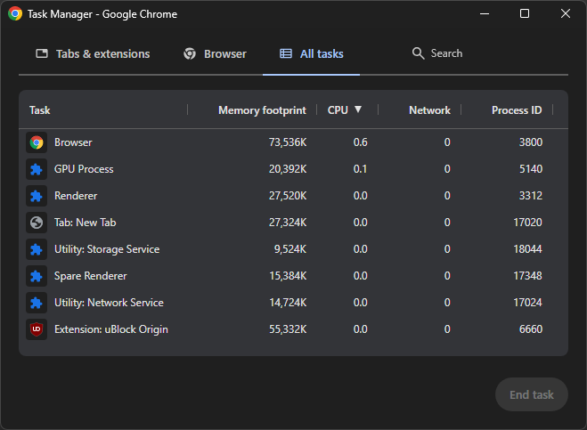

</details>

<details>
<summary>🔍 SearXNG</summary>

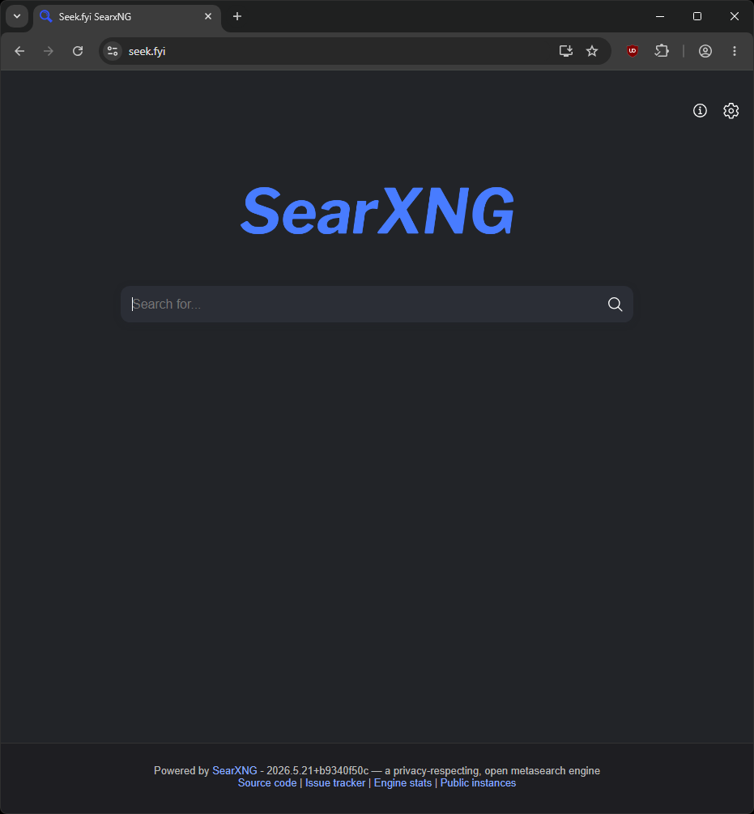
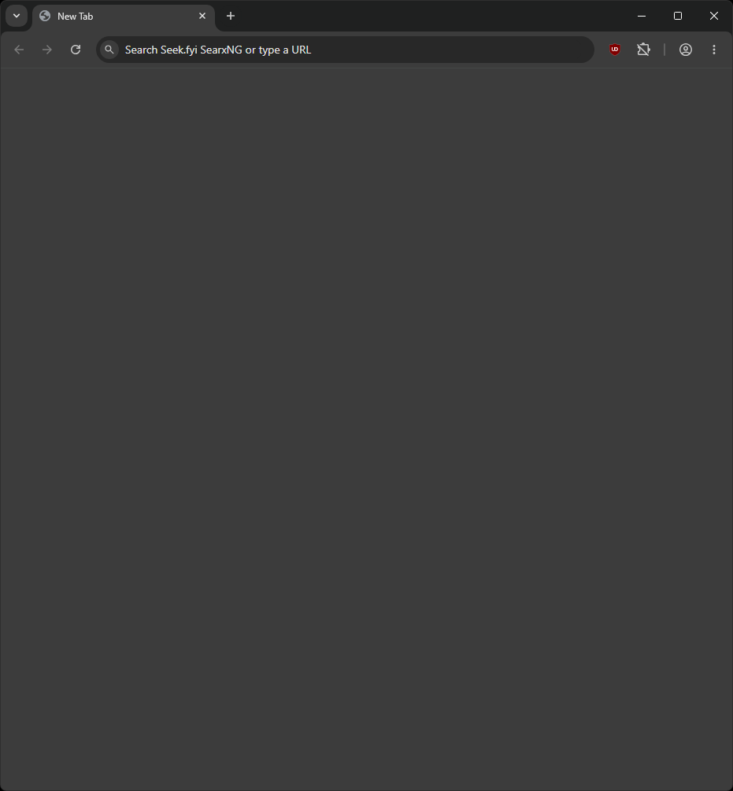

</details>

<details>
<summary>📜 Policies</summary>

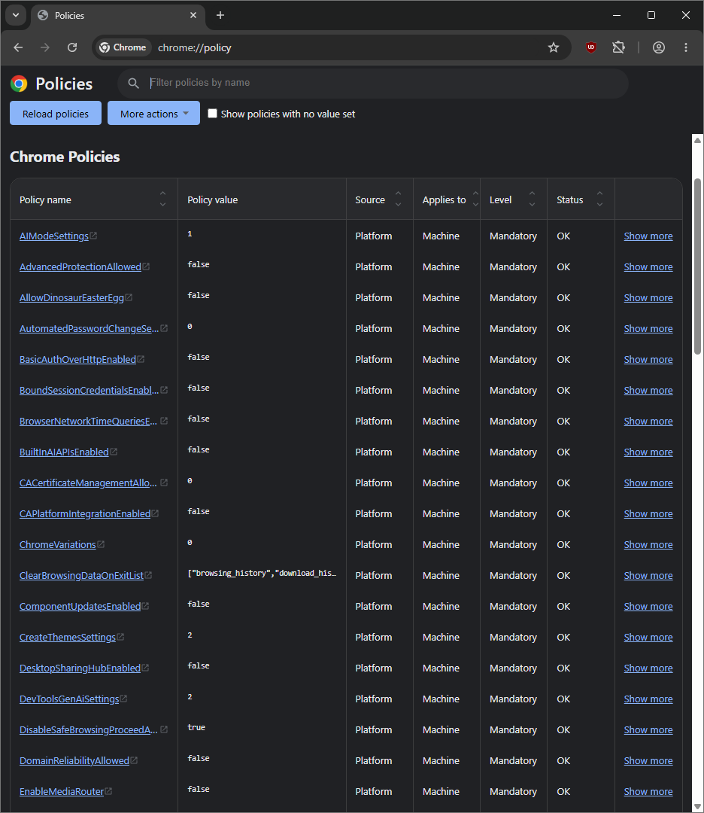
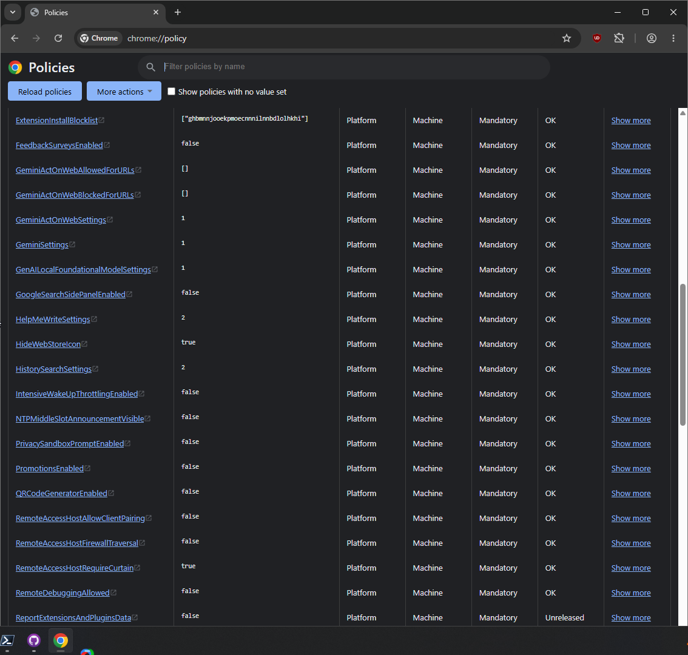
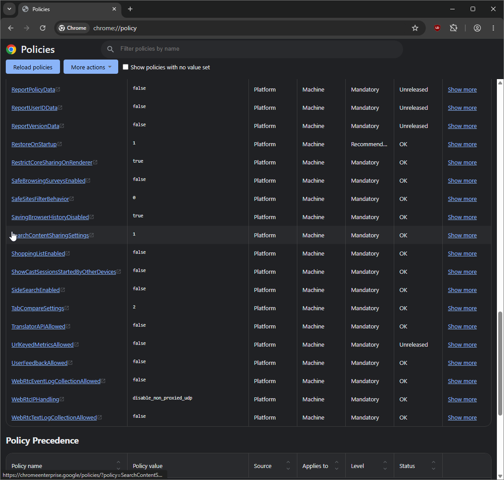
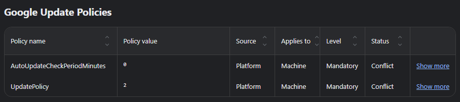

</details>

<details>
<summary>🧪 Experiments</summary>

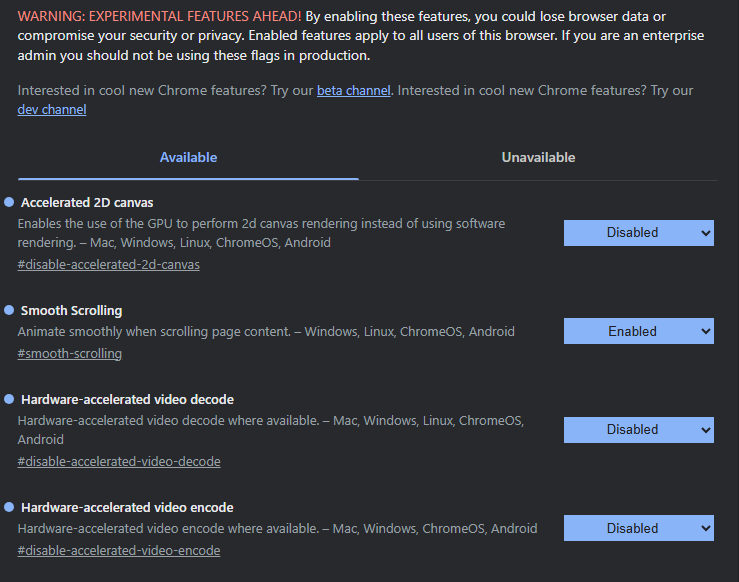
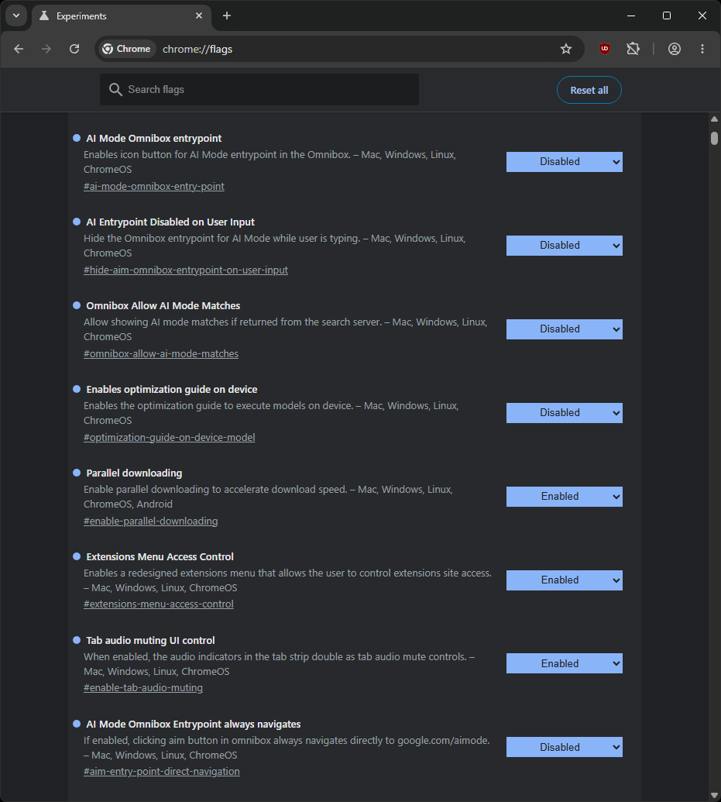

</details>

---

## 💖 Support & Donations
* ⭐ **Star** this repository to help others discover it.
* 🐛 **[Open an issue](https://github.com/powershello/ChromeSetup/issues)** if you find bugs or want to request new features.
* 🔀 **[Contribute](https://github.com/powershello/ChromeSetup/pulls)** by submitting a pull request.

If you find this project useful and want to support its ongoing development, maintenance, please consider donating. Your support is deeply appreciated!

[](https://buymeacoffee.com/xolagginc)

## 🏅 Contributors
[](https://github.com/powershello/ChromeSetup/graphs/contributors)

<a href="https://star-history.com/#powershello/ChromeSetup&Date">
 <picture>
   <source media="(prefers-color-scheme: dark)" srcset="https://api.star-history.com/svg?repos=powershello/ChromeSetup&type=Date&theme=dark" />
   <source media="(prefers-color-scheme: light)" srcset="https://api.star-history.com/svg?repos=powershello/ChromeSetup&type=Date" />
   
 </picture>
</a>
